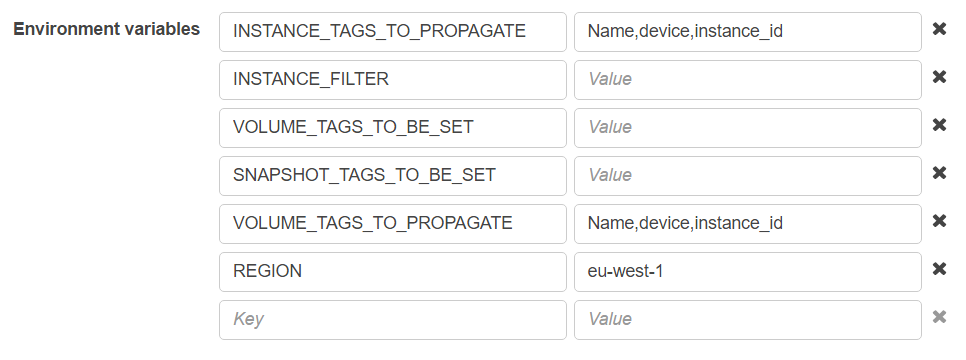

# Lambda Graffiti Monkey

An AWS Lambda function to run [Graffiti Monkey](https://github.com/Answers4AWS/graffiti-monkey) serverless. This function works great when triggered by a CloudWatch Events scheduled rule.

## Table of Contents

- [Installation](#installation)
- [Usage](#usage)

## Installation

Begin by creating a new virtualenv and installing the required python modules:

```sh
$ cd lambda-graffiti-monkey
$ virtualenv -p /usr/bin/python2.7 graffiti-monkey
$ source graffiti-monkey/bin/activate
(graffiti-monkey) $ pip install -r requirements.txt
```

## Usage

### Running Locally (for testing and development, etc.)

First we need to set some environment variables for Graffiti Monkey to use, so just paste the below into your shell setting tags as required:

```sh
(graffiti-monkey) $ export REGION="eu-west-1"
(graffiti-monkey) $ export INSTANCE_TAGS_TO_PROPAGATE="Name,device,instance_id"
(graffiti-monkey) $ export VOLUME_TAGS_TO_PROPAGATE="Name,device,instance_id"
(graffiti-monkey) $ export VOLUME_TAGS_TO_BE_SET=""
(graffiti-monkey) $ export SNAPSHOT_TAGS_TO_BE_SET=""
(graffiti-monkey) $ export INSTANCE_FILTER=""
```

Now we can just execute the function using the [python-lambda](https://github.com/nficano/python-lambda) tool:

```sh
(graffiti-monkey) $ lambda invoke -v
Loading function
Releasing the Graffiti Monkey
Graffiti Monkey completed successfully!
```

### Deploying to AWS Lambda

#### Auth Setup

Either edit the config.yaml file for the python-lambda tool and insert your aws_access_key_id and aws_secret_access_key or set your AWS credentials up as per the AWS CLI standard or via environment variables.

#### IAM Role Setup

By default the python-lambda tool will look to use an IAM role called 'lambda_basic_execution' so create this role in advance (or edit the config.yaml accordingly).

#### Deploying to Lambda

Just execute the lambda deploy commend. This will evaluate your virtualenv and identify your project dependencies. It will package these up along with your handler function to a zip file that it then uploads to AWS Lambda.

You can now log into the [AWS Lambda management console](https://console.aws.amazon.com/lambda/) to verify the code deployed successfully.

```sh
(graffiti-monkey) $ lambda deploy
Gathering pip packages
Installing appdirs==1.4.3
Installing boto==2.47.0
Installing boto3==1.4.1
Installing botocore==1.4.61
Installing click==6.6
Installing docutils==0.12
Installing futures==3.0.5
Installing graffiti-monkey==0.9.0
Installing jmespath==0.9.0
Installing packaging==16.8
Installing pip==9.0.1
Installing pyaml==15.8.2
Installing pyparsing==2.2.0
Installing python-dateutil==2.5.3
Installing python-lambda==0.5.0
Installing PyYAML==3.11
Installing s3transfer==0.1.10
Installing setuptools==35.0.2
Installing six==1.10.0
Installing wheel==0.29.0
Installing wsgiref==0.1.2
Found credentials in environment variables.
Starting new HTTPS connection (1): lambda.eu-west-1.amazonaws.com
Creating your new Lambda function
Starting new HTTPS connection (1): sts.amazonaws.com
Starting new HTTPS connection (1): lambda.eu-west-1.amazonaws.com
```

#### Setting Lambda Environment Variables

For Graffiti Monkey to run properly you will need to set the following Lambda environment variables:



Now you can save and test the function.